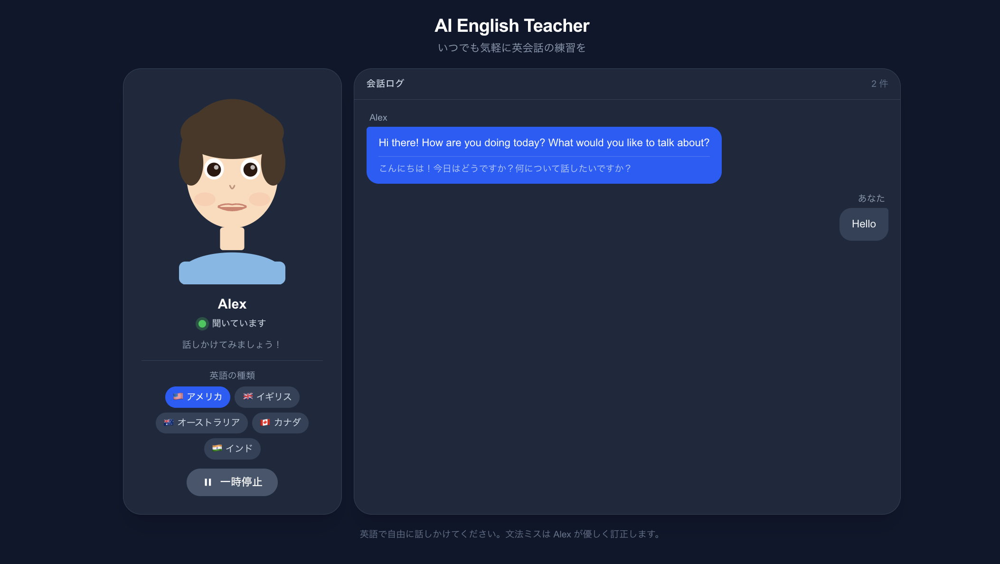

# AI English Teacher

AIアバターとリアルタイムで英会話練習ができるWebアプリ。ブラウザを開くとすぐに会話が始まります。



## 機能

- **リアルタイム音声会話** — OpenAI Realtime API (WebRTC) による超低遅延の音声対話
- **2Dアバター** — 音声に合わせて口が動くリップシンク付きアニメーション
- **英語アクセント切り替え** — 🇺🇸 アメリカ / 🇬🇧 イギリス / 🇦🇺 オーストラリア / 🇨🇦 カナダ / 🇮🇳 インド
- **文法・表現の訂正** — 話し終わると自然な流れで改善点を指摘
- **日本語訳の併記** — Alexの発話に日本語訳をリアルタイム表示
- **日英混在の発話に対応** — 日本語と英語を混ぜて話してもOK
- **一時停止ボタン** — 会話を中断・再開できる

## セットアップ

```bash
npm install
```

`.env.local` を作成して OpenAI API キーを設定:

```
OPENAI_API_KEY=sk-...
```

```bash
npm run dev
```

[http://localhost:3000](http://localhost:3000) を開いてマイクを許可すると会話が始まります。

## デプロイ (Vercel)

[](https://vercel.com/new/clone?repository-url=https://github.com/yuta-ron/ai-english-teacher)

Vercel の Environment Variables に `OPENAI_API_KEY` を設定してください。

## 技術スタック

- [Next.js 15](https://nextjs.org) (App Router)
- [OpenAI Realtime API](https://platform.openai.com/docs/guides/realtime) (WebRTC)
- [Framer Motion](https://www.framer.com/motion/)
- Tailwind CSS
